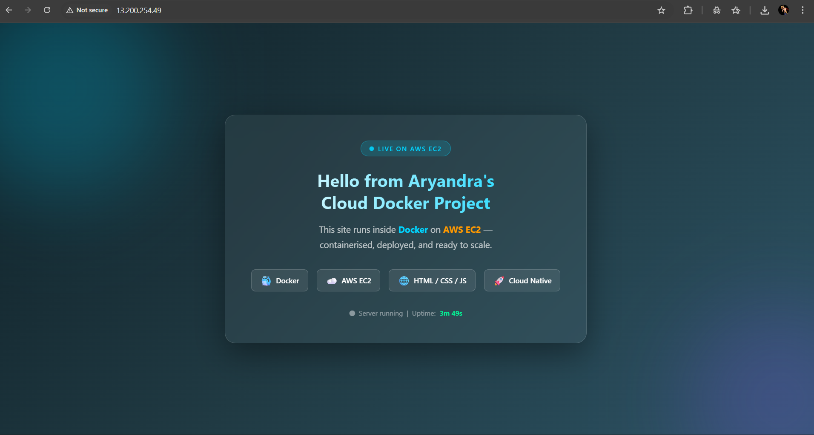
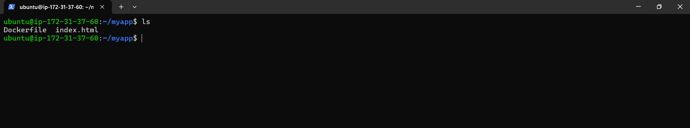

# Dockerized Web Application on AWS EC2

This project demonstrates deploying a containerized web application on AWS using Docker and EC2.

## Architecture
User → Internet → AWS EC2 → Docker Container → Nginx → Website

## Technologies Used
- AWS EC2
- Linux (Ubuntu)
- Docker
- Nginx

## Steps Performed
1. Launched EC2 instance and configured security groups
2. Installed Docker on Linux server
3. Created custom Docker image with a static website
4. Ran container with port mapping
5. Verified public access via EC2 IP

## Result
The application runs inside a Docker container on AWS and is publicly accessible via browser.

## Learning Outcome
This project helped me understand:
- Cloud compute provisioning
- Containerization workflow
- Networking and port mapping
- Deployment lifecycle on AWS

## Screenshots

### EC2 Instance Running

### Docker Container Running

### Website Live on AWS

### Dockerfile Used for Build

- ## Cleanup & Cost Control

To avoid unnecessary AWS charges after completing the project, all cloud resources were properly removed.

The following steps were performed:

- Stopped and terminated the EC2 instance
- Removed associated security groups if unused
- Deleted unused key pairs and snapshots
- Verified no running resources remained in the AWS dashboard

This reflects real-world cloud practices where infrastructure is provisioned temporarily for deployment and testing, then safely decommissioned to control costs.
